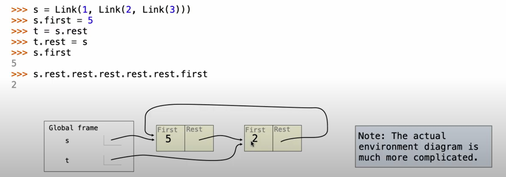

# Lec15 Linked List
## Linked lists
A linked list is either empty or a first value and the rest of the list.
We can view it as a pair of values: the first value and the rest of the list.
We say the first element as an attribute value, and the rest attribute are linked lists.

Link(3, Link(4, Link(5, Linked.empty)))

**Implement Linked Lists**
```python
class Link:
    empty = ()

    def __init__(self, first, rest=empty):  
        assert rest is Link.empty or isinstance(rest, Link)
        self.first = first
        self.rest = rest
```

## Linked List Processing
**Example: Range, Map, and Filter for Linked Lists**
```python
square, odd = lambda x: x**2, lambda x: x%2 == 1
list(map(square, filter(odd, range(6)))) # For lists, we have built-in funcs to do this
map_link(square, filter_link(odd, range_link(6)))
# Now we implement user defined functions

def range_link(start, end):
    """Return a link containing consecutive integers from start to end.
    >>>range_link(3, 6)
    Link(3, Link(4, Link(5)))
    """
    if start >= end:
        return Link.empty
    else:
        return Link(start, range_link(start+1, end))


def map_link(f, s):
    """Return a link that contains f(x) for each x in link s.
    >>> map_link(square, range_link(3, 6))
    Link(9, Link(16, Link(25)))
    """
    if s is Link.empty:
        return s
    else:
        return Link(f(s.first), map_link(f, s.rest))


def filter_link(f, s):
    """Return a link that contains only the elements of s for which f(x) is true.
    >>> filter_link(odd, range_link(3, 6))
    Link(3, Link(5))
    """
    if s is Link.empty:
        return s
    else:
        filtered_rest = filter_link(f, s.rest) # different from map_link, because we need to filter every node in the link
        if f(s.first):
            return Link(s.first, filtered_rest)
        else:
            return filtered_rest
```

## Linked List Mutation
Linked lists can change. We can change `first` and `rest` using attribute assignments.
```python
s = Link(1, Link(2, Link(3)))
s.first = 5
t = s.rest
t.rest = s
s.first
>>> 5
s.rest.rest.rest.rest.rest.first
>>> 2
```
To understand this, we need to think about the memory layout of linked lists.
Think about pointers, when we make t.rest = s, we in fact change the node whose value is 2 to point to 5.
Therefore, node 3 is not used, and node 5 and node 2 point to each other.


## Linked List Mutation Example
Implement function add to the ordered list s, return modified s.
```python
def add(s, v):
    """Add v to an ordered list s with no duplicates.
    If v is already in s, return s.
    >>> s = Link(1, Link(2, Link(3)))
    >>> add(s, 4)
    Link(1, Link(2, Link(3, Link(4))))
    """
    # Think of different situations and solve them, especially the very first(zeroth) and the last element
    assert s is not Link.empty
    if s.first > v:
        s.first, s.rest = v, s
    elif s.first < v and s.rest is Link.empty:
        s.rest = Link(v)
    elif s.first < v:
        add(s.rest, v) # recursion
    return s
```

## Example: Linked Lists
Several exercises.
How to judge whether a link is ordered from small to large?
How to judge whether a link is ordered from small to large by a certain function (eg. abs)?
How to create a sorted link containing all elements from 2 sorted links?
```python
def ordered(s, key=lambda x: x):
    """Return True if Link s is ordered from small to large, and a key function is involved
    >>> ordered(Link(1, Link(2, Link(3))))
    True
    >>> ordered(Link(1, Link(3, Link(2))))
    False
    >>> ordered(Link(1, Link(3, Link(2))), key=abs)
    True
    """
    if s is Link.empty or s.rest is Link.empty:
        return True
    elif key(s.first) > key(s.rest.first):
        return False
    return ordered(s.rest, key) # Use recursion

def merge(s, t):
    """Return a sorted link containing all elements from s and t.
    >>> merge(Link(1, Link(2, Link(3))), Link(1, Link(2, Link(3))))
    Link(1, Link(1, Link(2, Link(2, Link(3, Link(3))))))
    """
    if s is Link.empty:
        return t
    elif t is Link.empty:
        return s
    elif s.first < t.first:
        return Link(s.first, merge(s.rest, t))
    else:
        return Link(t.first, merge(s, t.rest))
        # Use recursion, compare one by one


def merge_in_place(s, t):
    """Return a sorted link containing all elements from s and t, without calling Link.
    >>> s = Link(1, Link(2, Link(3)))
    >>> t = Link(1, Link(2, Link(3)))
    >>> merge_in_place(s, t)
    Link(1, Link(1, Link(2, Link(2, Link(3, Link(3))))))
    """
    if s is Link.empty:
        return t
    elif t is Link.empty:
        return s
    elif s.first < t.first:
        s.rest = merge_in_place(s.rest, t) # Change s directly instead of using Link to create new links.
        return s
    else:
        t.rest = merge_in_place(s, t.rest)
        return t
```
