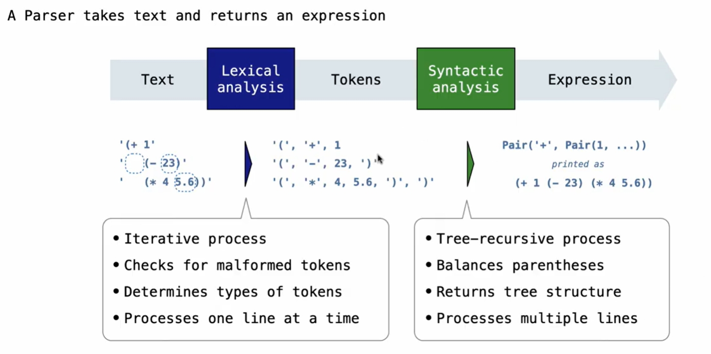
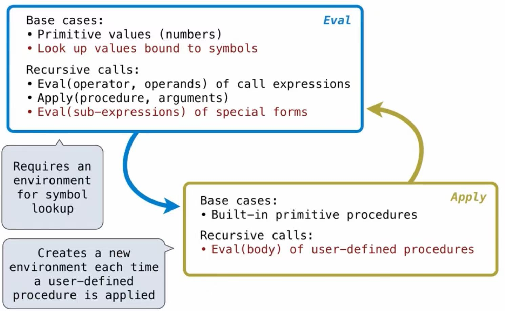

# Lec 19: Interpreters
## Programming Languages
**Machine languages:** statements are interpreted by hardware directly
* A fixed set of instructions
* Operations refer to specific hardware memory addresses, and no abstractions allowed

**High-level languages:** statements and expressions are interpreted by another program, or compiled(translated) into another language
* Provide means of abstraction such as naming, functions and objects
* Abstract away system details to be independent of hardware and operating systems

## Metalinguistic Abstraction
A powerful form of abstraction where we create new languages to solve problems in a particular domain
A programming language has:
* Syntax: the legal statements and expressions of the language
* Semantics: the meaning of those statements and expressions

## Parsing
eg. Translate the texts into an expression tree (Scheme)
The challenge of parsing is to turn strings of expressions into expressions itself


**Syntactic Analysis:** identifies the hierarchical structure of the input, which might be nested
Base case: symbols and numbers
Recursive case: reads sub-expressions and combines them into larger expressions

Now we try to do this in Python
## Evaluation
The eval function computes the value of an expression, which is always a number.
It is a generic function that dispatches on the type of the expression (primitive or call)
**Implementation:**
```python
def calc_eval(exp):
    if type(exp) in (int, float):  # numbers evaluate to themselves
        return exp
    elif isinstance(exp, Pair): # meaning that it is a scheme list
        arguments = exp.second.map(calc_eval) # recursively call calc_eval, returns a number for each operand
        return calc_apply(exp.first, arguments)# apply whether plus or minus or times or divide on the arguments(a scheme list of numbers)
    else:
        raise TypeError(str(exp) + " is not a number or a list")

def calc_apply(op, args):
    if not isinstance(op, str):
        raise TypeError(str(op) + " is not a symbol")
    if op == '+':
        return reduce(add, args, 0) # add is a function that takes two numbers and returns their sum
    elif op == '-':
        if len(args) == 0:
            raise TypeError("expected at least 1 argument, got 0")
        elif len(args) == 1:
            return -args.first 
        else:
            return reduce(sub, args.second, args.first) # sub is a function that takes two numbers and returns their difference
    elif op == '*':
        return reduce(mul, args, 1) # mul is a function that takes two numbers and returns their product
    elif op == '/':
        if len(args) == 0:
            raise TypeError("expected at least 1 argument, got 0")
        elif len(args) == 1:
            return div(1, args.first) # div is a function that takes two numbers and returns their quotient
        else:
            return reduce(div, args.second, args.first)
    else:
        raise TypeError(str(op) + " is not a valid operator")

def reduce(fn, scheme_list, start):
    if scheme_list is nil:
        return start
    else:
        return reduce(fn, scheme_list.second, fn(start, scheme_list.first))
```

## Interactive Interpreter
**Read-Eval-Print Loop (REPL)**
The user interface of many programming languages is an interactive interpreter:
* Print a prompt
* Read text input from the user
* Parse the text into an expression
* Evaluate the expression
* If error occurs, print an error message
* Print the result and repeat

Now we try to implement a REPL in Python, based on the calc_eval and calc_apply functions above.
```python
def read_eval_print_loop():
    while True:
        try:
            src = buffer_input()
            while src.more_on_line():
                exp = scheme_read(src)
                val = calc_eval(exp)
                print(val)
        except(SyntaxError, TypeError, ValueError, ZeroDivisionError) as err:
            print(type(err).__name__ + ':', err)
        except(KeyboardInterrupt, EOFError): # <ctrl>-C or <ctrl>-D
            print('Calculation completed.')
            return
```

**Raising Exceptions**
Exceptions are raised when an error occurs during evaluation

**Handling Exceptions**
An interactive interpreter should print info about each error.
A well-designed interpreter should not halt on errors, but continue to process subsequent inputs.
That is not to let the whole program crash because of one error, but give the user a chance to correct the error and continue.

In the above REPL implementation, we catch several types of exceptions and print the error type and message.
So it's important to use try statements to catch exceptions that may be raised during evaluation.

## Interpreting Scheme
We can extend the above calculator to interpret a subset of Scheme.
The structure of interpreter:


## Special Forms
The scheme_eval function dispatches on the type of expression:
- Symbols bound to values in the environment
- Self-evaluating expressions (numbers and empty list)
- Combinations (all other legal expressions, represented as pairs)

## Logical Forms
Logical forms are special forms that may only evaluate some of their sub-expressions:
* If expression: (if <predicate> <consequent> <alternative>)
* And expression: (and <exp1> <exp2> ...)
* Or expression: (or <exp1> <exp2> ...)
* Cond expression: (cond (<test1> <exp1>) (<test2> <exp2>) ... (else <expN>))

The value of an if expression is the value of a sub-expression, depending on the value of the predicate.

## Quotation
The quote special form prevents evaluation of an expression.
(quote <expression>)
The expression itself is the value of the quoted expression, a scheme list.
'<expression> is a shorthand for (quote <expression>)
The scheme_read parser converts shorthand to a combination of quote.

## Lambda Expressions
Lambda expressions evaluate to user-defined procedures.
(lambda (<formal-parameters>) <body>)
Introduce a class in python: LambdaProcedure
```python
class LambdaProcedure(Procedure):
    """A procedure defined by a lambda expression."""

    def __init__(self, formals, body, env):
        self.formals = formals # a scheme list of symbols
        self.body = body # a scheme expression
        self.env = env # a frame instance

    def __str__(self):
        return str(Pair('lambda', Pair(self.formals, self.body)))
```

**Frames and Environments**
A frame represents an environment by having a parent frame
Frames are Python instances with *lookup* and *define* methods
```python
g = Frame(None) # global frame
g.define('x', 1)
g.define('y', 2)
g.lookup('x') # returns 1
g.lookup('y') # returns 2
f1 = Frame(g) # child frame of g
f1.define('x', 3) # shadows global x
f1.lookup('x') # returns 3
f1.lookup('y') # returns 2, found in parent frame g
```

## Define Expressions
Bind symbols to values in the current environment frame.
(define <symbol> <expression>)
1. Evaluate the expression to get a value
2. Bind the <symbol> to the value in the current environment frame
(define (<symbol> <formal-parameters>) <body>), it is a shorthand for defining a lambda procedure and binding it to the symbol.

Apply User-defined Procedures
Create a new frame in which formal parameters are bound to argument values, whose parent is the env of the procedure.
Then evaluate the body of the procedure in that new frame.

## Dynamic Scope
The way names are looked up in Scheme and Python is called **lexical scope** or **static scope**: The parent of a frame is the environment in which the procedure was **defined**.
An alternative is **dynamic scope**, the parent of a frame is the environment in which the procedure was **called**.

Example:
```scheme
(define f (lambda (x) (+ x y)))
(define g (lambda (x y) (f (+ x x))))
(g 3 7)
```
In lexical scope, f's parent frame is the global frame, because it is defined first, so when the value of y is looked up in the global frame, which is unbound, resulting in an error.
In dynamic scope, f's parent frame is the frame created by the call to g, so y is bound to 7, and the result is 13.