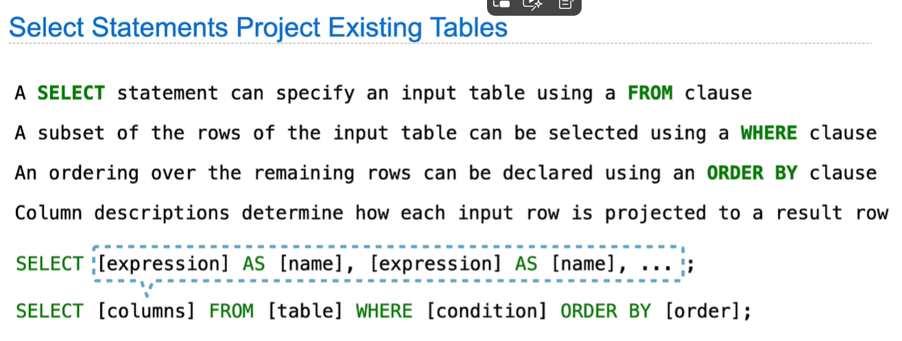
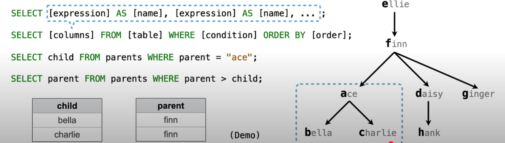

# Lec23: SQL
## Databases
### Database Management System (DBMS)
Record and retrieve data and serve as the primary data storage for an software application.
They organize info in `table`, collection of records, which are `rows` that have a value for each `column`.
A table has rows and columns.
Example: Cities

|Latitude|Longitude|City_name|
|:--------:|:---------:|:-------------:|
|38|122|Berkeley|
|42|71|Cambridge|
|45|93|Minneapolis|
|34|118|Los Angeles|

A `column` has a name and a type(int, string,...).
A `row` has a value for each column, corresponding to the type.

## Structured Query Language (SQL)
SQL is a declarative language.
### Declarative Language
In a `declarative language`:
- A `program` is the description of the desired result
- The interpreter figures out how to generate the desired result

While in a `imperative language`:
- A `program` is a description of computational processes
- The interpreter carries out execution/evaluation rules

### SQL
```sql
SELECT "WEST COAST" AS region, name FROM "CITIES"
    WHERE longitude < 115
    ORDER BY latitude;
```
This creates a new table, getting a new column `region`, and gets column `name` from table `CITIES`
Result table:
|region|name|
|:--------:|:---------:|
|WEST COAST|Los Angeles|
|WEST COAST|Berkeley|

A `SELECT` statement includes comma-separated list of columns to select.
A column description is an expression, optionally followed by `AS` and a new column name.
SELECT [expression] AS [new_name], [expression] AS [new_name], ...
A `CREATE TABLE` statement creates a new table.
CREATE TABLE [table_name] as [select_statement]

In SQL, `UNION` is a set operator used to combine the results of two or more SELECT statements into a single result set.
```sql
SELECT name FROM customers
UNION
SELECT name FROM suppliers;
```
`UNION`: Removes duplicate rows (performs a DISTINCT operation on the combined result).
`UNION ALL`: Includes all rows, including duplicates (faster than UNION because it skips the deduplication step).

## Projecting Tables
A `SELECT` statement can specify an input table using a `FORM` clause.


Use quotes when mentioning a specific value, and no quotes when mentioning a column name.

## Arithmetic Expressions
