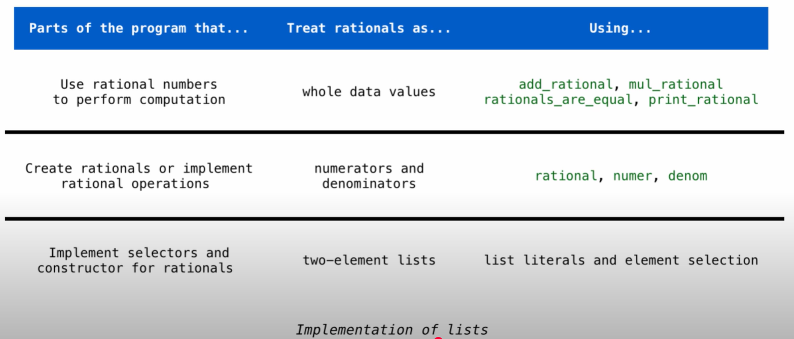

# Lec8: Data Abstraction and ADT Trees

**Data Abstraction**
An abstraction data type (ADT) lets us manipulate compound objects as units, a methodology by which functions enforce an abstraction barrier between representation and use.
Isolate 2 parts of a program that uses date:

* How data are represented (as parts)
* How data are manipulated (as units)

*Example: Rational Numbers*
Fraction:$\frac{numerator}{denominator}$, can be viewed as a pair of integer. Once the division occurs, the fraction is evaluated into a float, which might not be precise.

Assume we can compose rational numbers:

* rational(n, d) returns a rational number x
* numer(x) returns the numerator of x
* denom(x) returns the denominator of x

The function `rational` creates a rational number, while `numer` and `denom` retrieve its numerator and denominator, respectively.
rational function is called a constructor.
numer and denom functions are called selectors.

The 3 functions implements an abstract data type: *rational numbers*.

```python
def mul_rational(x, y):
    return rational(numer(x) * numer(y), denom(x) * denom(y))

def add_rational(x, y):
    return rational(numer(x) * denom(y) + numer(y) * denom(x), denom(x) * denom(y))

def equal_rational(x, y):
    return numer(x) * denom(y) == numer(y) * denom(x)
```

To do reduction, just import `gcd` from `math` module, and divide gcd from n and d.

**Pairs**
2 values bound together, treated as a unit.
Use list to create pairs.

**Abstraction Barrier**
To separate each part of the program.
Refer to the picture


In this picture, the lines between different layers are the abstraction barrier.
Different layers represent different aspects of the program, and we should not use functions in other layers to finish the tasks in this layer.
For example, if we want to print rational numbers, we should not use `numer` and `denom` functions, but `print_rational` function.

We can view the implementation of lists as the base layer, and we needn't know how python implements lists.

By using abstraction barrier and not crossing the boundaries, we can change different parts of our program easily.

*Example:*
```python
add_rational([1, 2], [3, 4])
"""This row breaks the abstraction barrier, because we didn't use a constructor in this layer. We should use whole data values, which is rational numbers.
Instead, we should use:
add_rational(rational(1, 2), rational(3, 4))
"""

def div_rational(x, y):
    return [ x[0] * y[1], x[1] * y[0]]
"""This is also wrong, for we are not supposed to know that x and y are lists in this layer. We should use numer and denom functions instead. 
No selectors!
And, we should not directly return [], but use a constructor to create a rational. 
No constructors!
def div_rational(x, y):
    return rational(numer(x) * denom(y), denom(x) * numer(y))
"""
```

**Data Representations**
We need to guarantee that constructor and selector functions work together to specify the right behavior.
Data abstraction use constructor and selector to define behavior.
Behavior condition: if we construct rational number x, then numer(x)/denom(x) must equal to n/d.
If the condition is met, the representation of data abstraction is valid.
That is, we can recognize data by its behavior.

When we want to change sth, for example:
```python
def rational(n, d):
    def select(name):
        if name == 'n':
            return n
        elif name == 'd':
            return d
    return select

def numer(x):
    return x('n')

def denom(x):
    return x('d')
```
This is a new way to implement rational numbers, we changed some parts, but the behavior of rational numbers is not changed.

In this version, we use functions to implement rational number, instead of using a list. And we only changed the 2nd layer, needn't change the top layer in which represents the operations of rational numbers.

**Trees**
A data abstraction representing hierarchical relationships.
*Common vocabulary used to describe trees:*
Two metaphors:
1.Recursive description (wooden tree):
    -A tree has a `root label` and a *list* of `branches`, and each branch is also a tree. 
    -A tree with 0 branches is called a leaf. 

2.Relative description (family tree):
    -Each location is called a node, and each node has a label that can be any value.
    -One node can be a parent or child of another.
    -Other words like `ancestors`, `descendants`, and `siblings` can also be used.

Fibonacci tree: parents' label is the sum of its children.

*Implementing the Tree Abstraction:*
TODO:
        3
       / \\
      1   2
         / \\
        1   1
tree(3, [tree(1), tree(2, [tree(1), tree(1)])]) to generate a tree like this.
A tree using a list to represent:
[Root label, left branch, right branch.]
[3, [1], [2, [1], [1]]]

In our definition we mentioned a tree has a **list** of branches, so we're not breaking the abstraction barrier when we use lists to implement the `tree` data type. In other words, we don't need selectors in this case.

```python
def tree(label, branches = []):  # = [] means by default, branches is empty
    for branch in branches:
        assert is_tree(branch)
    return [label] + list(branches)

def label(tree):
    assert is_tree(tree)
    return tree[0]

def branches(tree):
    assert is_tree(tree)
    return tree[1:]

def is_tree(tree):
    if type(tree) != list or len(tree) < 1:
        return False
    for branch in branches(tree):
        if not is_tree(branch):
            return False
    return True

def is_leaf(tree):
    return not branches(tree)
```

**Tree Processing**
Func that takes a tree as an input or returns a tree as an output are often tree recursive themselves.

*Example:Fib Trees, which has a fib number as its label.*

```python
def fib_tree(n): 
    """ n as the index of the fib number, fib(0) = 0, fib(1) = 1, fib(2) = 1, fib(3) = 2, fib(4) = 3, etc."""
    if n == 1:
        return tree(n)
    else:
        left, right = fib_tree(n-2), fib_tree(n-1)
        return tree(label(left) + label(right), [left, right])

def count_leaf(tree):
    """Use recursive ways to count leafs of a tree."""
    if is_leaf(tree):
        return 1
    else:
        return sum(count_leaf(branch) for branch in branches(tree))

def leaves(tree):
    #Hint: use sum function to get a sum of list, whose result is a new list containing all the elements.
    """Return a list of all leaves in the tree."""
    if is_leaf(tree):
        return [label(tree)]
    else:
        return sum([leaves(branch) for branch in branches(tree)], [])

def increment_leaves(t):
    """Return a tree that is like t but with all leaf labels incremented by 1."""
    if is_leaf(t):
        return tree(label(t) + 1)
    else:
        return tree(label(t), [increment_tree(branch) for branch in branches(t)])
    #We need to get new branches and return the new tree with t's label and new branches.

def increment(t):
    """Increment all labels in a tree."""
    return tree(label(t) + 1, [increment(branch) for branch in branches(t)])
    #When we reach a leaf, we return tree(label + 1, []), so the recursion finishes.
```

**Example: Printing Trees**
```python
def print_tree(t):
    print(label(t))
    for branch in branches(t):
        print_tree(branch)
"""But we can't see the structure of the tree, only the label values. Here's a better version, using indentation:"""

def print_tree_indent(t, indent=0):
    print('  ' * indent + str(label(t)))
    for branch in branches(t):
        print_tree(branch, indent + 1)
"""By using indentation,
we can see the structure of the tree. 
The indentation level of a value corresponds to its depth in the tree. 
If they're at the same layer of the tree, they're printed in the same column.

print_tree_indent(fib_tree(4))
>>>
3
  1
    0
    1
  2
    1
    1
      0
      1
"""
```

**Example: Summing Paths**
Summing path: the sum of all the labels along a path from the root to a leaf.

2 strategies of recursive functions:
```python
def fact(n):
    if n == 0:
        return 1
    else:
        return n * fact(n - 1)
```
This is the first strategy, in which the func take the return value of a recursive call, and manipulate it.

```python
def fact_times(n, k):
    """Return k*n*(n-1)*...*1"""
    if n == 0:
        return k
    else:
        return fact_times(n - 1, n * k)
```
This is the second strategy, in which we're not manipulating on the return value `fact_times`, which means that the return value is identical with the original func.
That is: func_times(n-1, n*k) == fact_times(n, k), which is true ofc.
By the time we hit the base case in `fact_times`, we have finished multiplying.

Next we focus on the sum of a path from a label to a leaf.
```python
def print_sum(t, sum_sofar):
    sum_sofar += label(t)
    if isleaf(t):
        print(sum_sofar)
    else:
        for branch in branches(t):
            print_sum(branch, sum_sofar)

numbers = tree(3, [tree(4), tree(5, [tree(6)])])
print_sum(numbers, 0)
>>>7
>>>14
#We get 2 sums, since we have 2 paths to get to leaves.

"""Use sum_sofar to either print out or as a new argument of the recursive call."""
```

**Counting Paths**
```python
def count_path(t, total):
    """Count the number of paths from the root to any node(not necessarily a leaf) in tree t for which the sum of labels along the path equals to total."""
    if label(t) == total:
        found = 1
    else:
        found = 0
    """If the label of t equals to total, we found a path, so we set found to 1. Then we count other paths in branches, and sum up."""
    return found + sum(count_path(branch, total - label(t)) for branch in branches(t))
```
